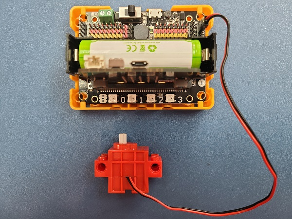
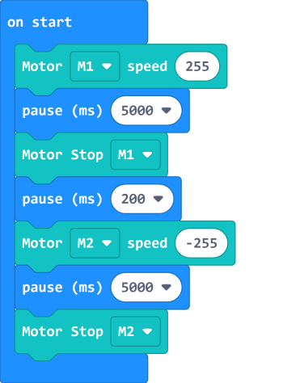
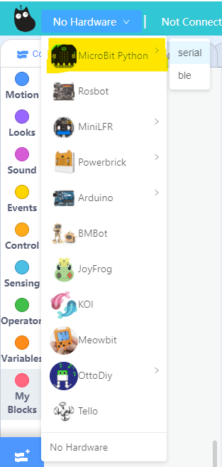

# Geekservo Motor

Geekservo Motor (HKBD9006A)

This is a small motor compatible with Lego technic parts, the output axle is compatible with Lego technic axles. It is mainly used in powering robots such as cars and driving gears.

## Specifications

- Voltage: 3.3V~6V
- Rated Voltage: 4.8V
- Rated Current: 200ma
- Blocked Rotor Current: 700ma
- Slipping Current: 450ma
- Maximum Torque: 500g/cm(4.8V)
- Maximum RPM: 70rpm(3V)
- Weight: 12.4g
- Connector: Red and Black Motor Connector
    
## Precautions

- This is only a small motor, please do not use it in situations requiring a very high torque and voltage.
- Geekservo still functions if the connection is reversed, but the rotation directio will be reversed as well.
- Do not block the rotor for prolonged periods of time or it may damage the motor.

## Dimensions:

### In Lego units:

- Length: 5
- Width: 2
- Height: 3
- Output axle: Technic Axle

### In mm units:

- Length: 40mm
- Width: 16mm
- Height: 34.4mm
- Output axle: Technic Axle

## Geekservo Features

- Clutch Protection:
    - In case of violent turning of the output axle, the clutch is enabled to protect the gears from damage.

- Flexible Installation:
    - Can be mounted on standard Lego bricks or with Technic elements, providing a lot of possibilities for installation.

- Small and lightweight:
    - Suitable for small robotic projects.

## Connection

### ArmourBit

Connect the motor to the motor ports on the Armourbit.

    Reversing the connection would not damage the motor, but the rotational direction will be reversed.
    
### RobotBit

Connect the motor to the motor ports on the Robotbit.

    Reversing the connection would not damage the motor, but the rotational direction will be reversed.

## MakeCode Coding Tutorial

### This module can be used by Micro:bit and Meowbit.

--------

### ArmourBit

### Load Powerbrick Extension: https://github.com/KittenBot/pxt-powerbrick

### [Loading Extensions](../Makecode/powerBrickMC)

### Blocks for controlling motors:

## Programming the motors

[Sample Code Link](https://makecode.microbit.org/_RYHivyayYL4q)

### Makecode Coding Tutorial Video

--------

### RobotBit

### Load Robotbit Extension:

### [Loading Extensions](../Makecode/powerBrickMC)

### Blocks for controlling motors:

### Programming the motors

[Sample Code Link](https://makecode.microbit.org/_c8F80i0Ta5cF)

---

### Meowbit:

### Load Robotbit Extension: https://github.com/KittenBot/meow-robotbit

### [Loading Extensions](../Makecode/powerBrickMC)

### Blocks for controlling motors:

### Programming the motors:

[Sample Code Link](https://makecode.com/_2z0C8v6XAC5y)

## Extension Version and Updates

There may be updates to extensions periodically, please refer to the following link to update/downgrade your extension.

[Makecode Extension Update](../Makecode/makecode_extensionUpdate)

## KittenBlock Coding Tutorial

---

### Armourbit

### Load Powerbrick Extension

Open the hardware menu and select Powerbrick to load the extension for Micro:bit and Powerbrick.

### Blocks for controlling motors:

### Programming the motors

---

### Robotbit

### Load Robotbit Extension

Open the hardware menu and select Micro:bit to load the extension for Micro:bit and Robotbit.

### Blocks for controlling motors:

### Programming the motors

## FAQ

1: The Micro:bit does not react when I click the programming blocks.

Make sure the Micro:bit has been connected to the Kittenblock and then try flashing the firmware.
