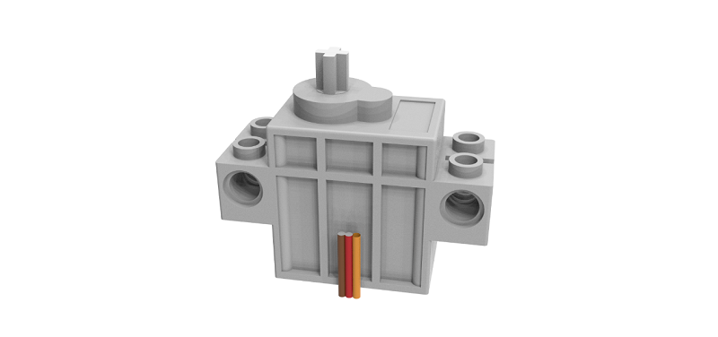
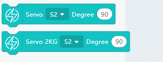

# Geekservo Servo

Geekservo Servo (HKBD9005A)

This is a small servo compatible to Lego Technic parts, the output axle is compatible with Lego technic axles. It is suitable for models requiring precise movements such as joints, doors or cranes.

## Specifications

- Operation Voltage: 3.3V~6V
- Rated Voltage: 4.8V
- Rated Current: 200ma
- Blocked Rotor Current: 700ma
- Slipping Current: 450ma
- Maximum Torque: 500g/cm(4.8V)
- Rotational Speed: 60°/0.12s
- Rotational Range: -45°~225°
- Weight: 12.4g
- Connector: Orange-Red-Brown Servo Connector
    
## Precautions

- This is a small servo only, do not use it for models that require a high torque.
- Servos should not be connected in the wrong way, please pay attention when connecting a servo.
- Do not block the rotor for prolonged periods of time or it may damage the motor.

## Dimensions:

### In LEGO units:

- Length: 5
- Width: 2
- Height: 3
- Output Axle: Technic Axle

### In mm units:

- Length: 40mm
- Width: 16mm
- Height: 34.4mm
- Output Axel: Technic Axle

## Geekservo Features

- Clutch Protection:
    - In case of violent turning of the output axle, the clutch is enabled to protect the gears from damage.

- Flexible Installation:
    - Can be mounted on standard Lego bricks or with Technic elements, providing a lot of possibilities for installation.

- Small and lightweight:
    - Suitable for small robotic projects.

## Connection

### ArmourBit

Connect the servo to the servo ports of the Armourbit.

    Orange to Yellow, Red to Red, Brown to Black.
    
### RobotBit

Connect the servo to the servo ports of the Robotbit.

    Orange to Yellow, Red to Red, Black to Black.

## MakeCode Coding Tutorial

### This module can be used by Micro:bit or Meowbit.

### The programming for Armourbit and Robotbit is identical.

### ArmourBit

### Load Powerbrick Extension: https://github.com/KittenBot/pxt-powerbrick

### [Loading Extensions](../Makecode/powerBrickMC)

### RobotBit

### Load Robotbit Extension:

### [Loading Extensions](../Makecode/powerBrickMC)

### Blocks for controlling servos:

### Programming servos:

[Sample Code Link](https://makecode.microbit.org/_APuPfVUHtMpe)

### Makecode Coding Tutorial

---

### Meowbit:

### Load Robitbit Extension: https://github.com/KittenBot/meow-robotbit

### [Loading Extensions](../Makecode/powerBrickMC)

### Blocks for controlling servos:

### Programming the servos:

[Sample Code Link](https://makecode.com/_WrrEcRhMm0o4)

## Extension Version and Updates

There may be updates to extensions periodically, please refer to the following link to update/downgrade your extension.

[Makecode Extension Update](../Makecode/makecode_extensionUpdate)

## KittenBlock Coding Tutorial

---

### Armourbit

### Load Powerbrick extension

Select Powerbrick from the Hardware Menu.

### Blocks for controlling servos:

### Programming the servos:

[Sample Code Link](https://bit.ly/PowerbrickM12_01sb3)

---

### Robotbit

### Load Robotbit Extension

Open the hardware menu and select Micro:bit to load the extension for Micro:bit and Robotbit.

### Blocks for controlling servos:

### Programming the servos

## FAQ

1: The Micro:bit does not react when I click the programming blocks.

Make sure the Micro:bit has been connected to the Kittenblock and then try flashing the firmware.
