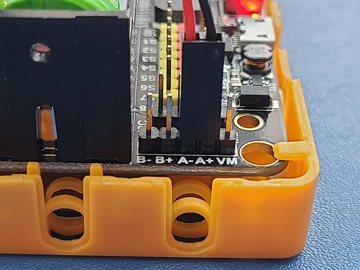
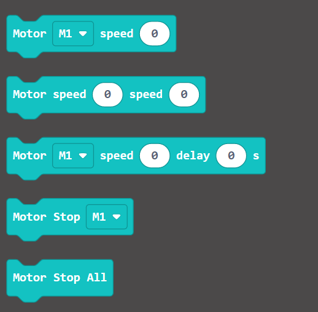
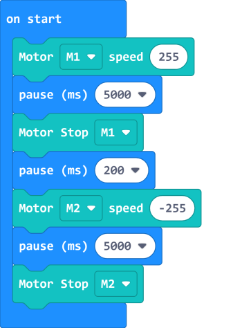
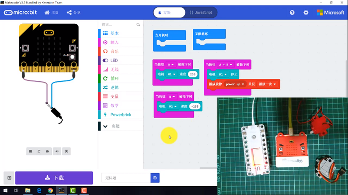
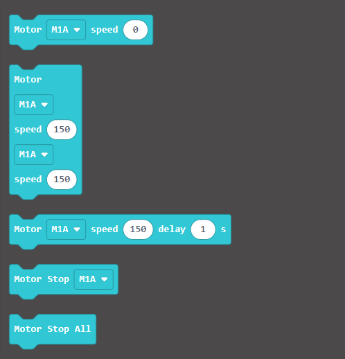
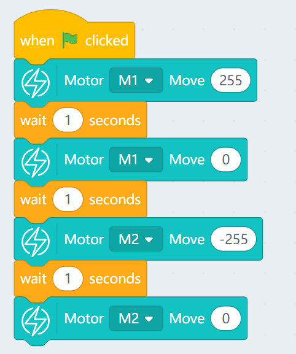

# T/T DC Motors

This is a DC motor with a low noise and high torque output.

## Connection

### ArmourBit

Connect the motor to the motor ports on the Armourbit.

    Plugging the motor in the reverse way will not damage the motor, but the rotating direction will be reversed.
    
### RobotBit

Connect the motor to the motor ports on the Robotbit.

    Plugging the motor in the reverse way will not damage the motor, but the rotating direction will be reversed.

## MakeCode Coding Tutorial

### This module can be used by both Micro:bit and Meowbit.

--------

### ArmourBit

### Load PowerBrick Extension: https://github.com/KittenBot/pxt-powerbrick

### [Loading Extensions](../Makecode/powerBrickMC)

### Blocks for controlling motors:

### Programming the motors

[Sample Code Link](https://makecode.microbit.org/_RYHivyayYL4q)

### Makecode Tutorial Video

--------

### RobotBit

### Load Robotbit Extension

### [Loading Extensions](../Makecode/powerBrickMC)

### Blocks for controlling motors:

### Programming the motors

[Sample Code Link](https://makecode.microbit.org/_c8F80i0Ta5cF)

------

### Meowbit:

### Load Robotbit Extension: https://github.com/KittenBot/meow-robotbit

### [Loading Extensions](../Makecode/powerBrickMC)

### Blocks for controlling motors:

### Programming the motors

[Sample Code Link](https://makecode.com/_2z0C8v6XAC5y)

## Extension Version and Updates

There may be updates to extensions periodically, please refer to the following link to update/downgrade your extension.

[Makecode Extension Update](../Makecode/makecode_extensionUpdate)

## KittenBlock Coding Tutorial

---

### Armourbit

### Load Powerbrick Extension

Open the hardware menu and select Powerbrick to load the extension for Micro:bit and Powerbrick.

### Blocks for controlling motors:

### Programming the motors

---

### Robotbit

### Load Robotbit Extension

Open the hardware menu and select Micro:bit to load the extension for Micro:bit and Robotbit.

### Blocks for controlling motors:

### Programming the motors

## FAQ

1: The Micro:bit does not react when I click the programming blocks.

Make sure the Micro:bit has been connected to the Kittenblock and then try flashing the firmware.