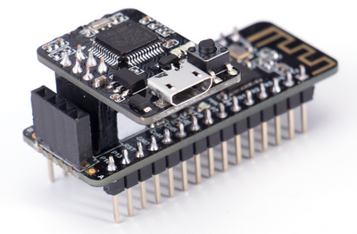

# Nanobit & MakeCode Programming

Nanobit's programming is identical to Micro:bit.

## Nanobit Downloader

There is no USB connector on the Nanobit, the Nanobit Downloader is required to download the program onto Nanobit.

Connect the downloader as shown in the picture, please beware of the orientation of the downloader.

Connect the USB cable to the Nanobit Downloader, a device named NanoBit will appear on the computer, upload the hex file onto the device, the program will be flashed onto Nanobit automatically.