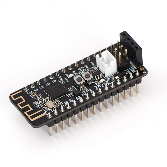
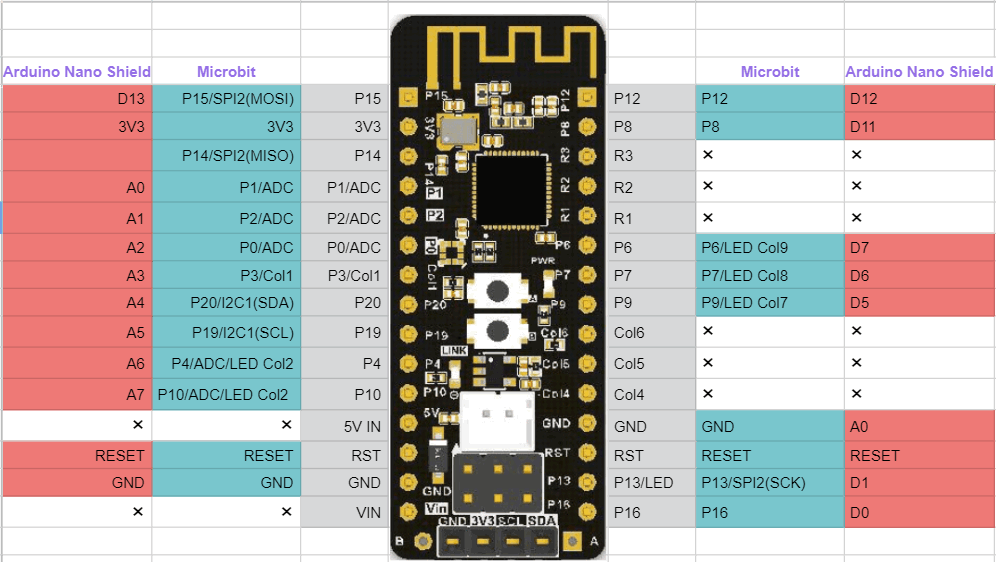
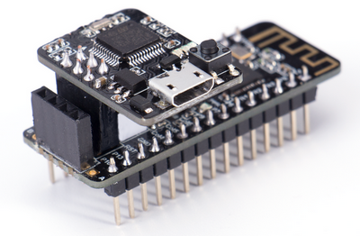

# Nanobit

Nanobit is a micro control board developed by KittenBot, it has all the functions of the BBC Micro:bit except it doesn't have the LED matrix found on the Micro:bit. Because the LED matrix has been omitted, the pins previously occupied by the matrix can be freely used on the Nanobit.

Despite Nanobit's small size, it has an array of useful sensors including but not limited to programmable buttons, accelerometer and temperature sensor, ensuring the full comprehensive functionality of the Nanobit. Nanobit and Micro:bit's similarity extends to the programming platform, like the Micro:bit, Nanobit can be programmed using the Microsoft MakeCode platform.

Nanobit's form factor is designed to facilitate Makers in designing and building smaller application use cases with full and complete functionality.

## Target Users

- Schools/Training Institutes
- Makers

## Special Features

- Compact yet fully featured, suitable for creating use cases with a small footprint
- Supports programming via MakeCode, users already familiar with Micro:bit can pick up immediately
- I2C port is prearranged to be compliant with the pinout of OLED modules commonly found on the market
- Compatible with existing expansion shields for Arduino Nano
- Can be used with Nanobit Shield to bring power functions to the Nanobit
- The GPIO pins are Dupont connectors, allowing for easy connection to breadboards or conventional sensors

## Package Contents

- Nanobit x1
- Nanobit Downloader x1

## Specifications

- Dimensions: 18.3 x 75 x 17 mm
- Weight: 6.9g 
- Main Controller: nRF51822  ARM Cortex-M0
- Input Voltage: 3.7V(Battery)/5V(USB)
- Output Voltage: 3.7V/5V
- Working Voltage: 3.7V
- Onboard Resources: Programmable Buttons x2, Temperature Sensor, Magnetic Sensor, Accelerometer, Wireless 2.4GHz&Bluetooth, I2C Port, Programmable LED(P15)
- Programming Platform: Microsoft MakeCode、KittenBlock、Python Editor、Arduino IDE
- Dimension on Breadboard: 6x15

## Nanobit Detailed Pinout

## Nanobit Downloader

Please beware of the orientation for the Nanobit Downloader

