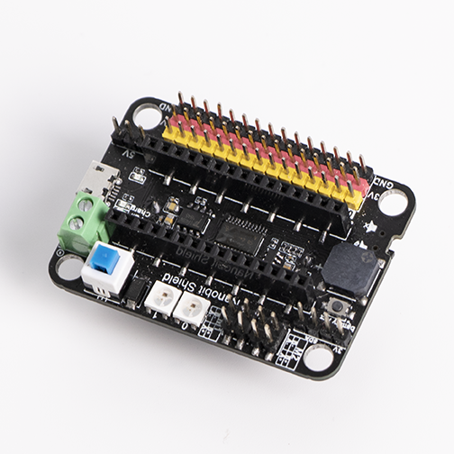
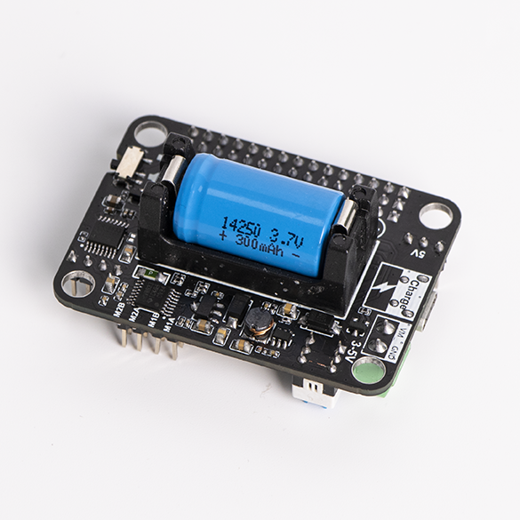
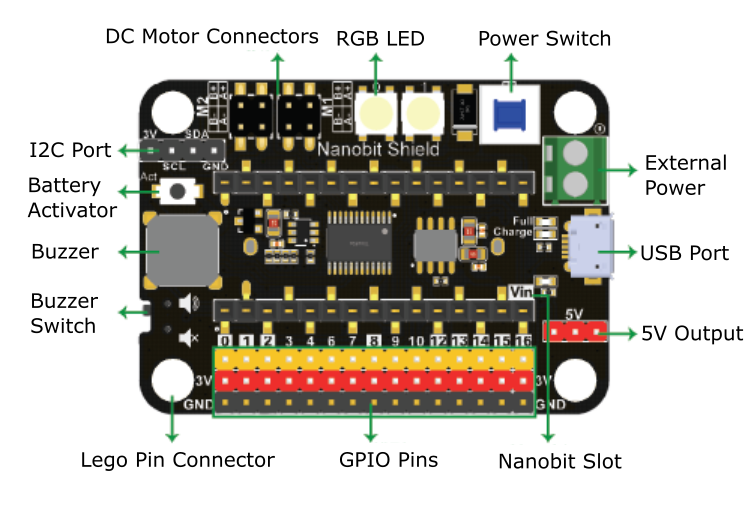
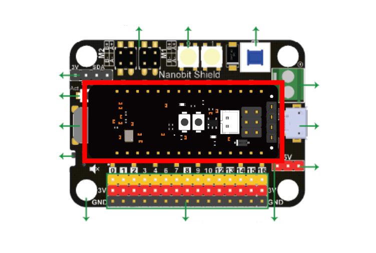
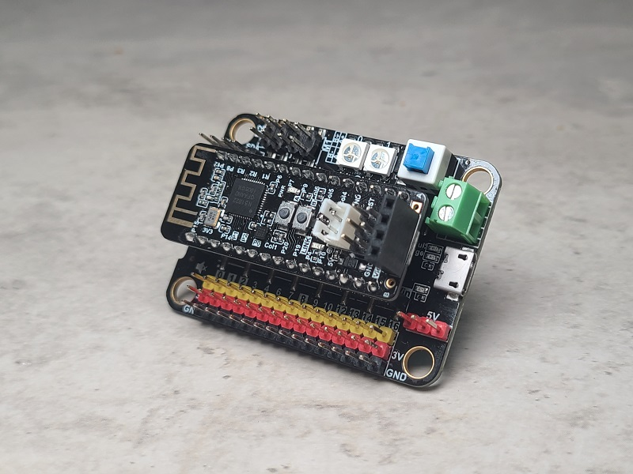
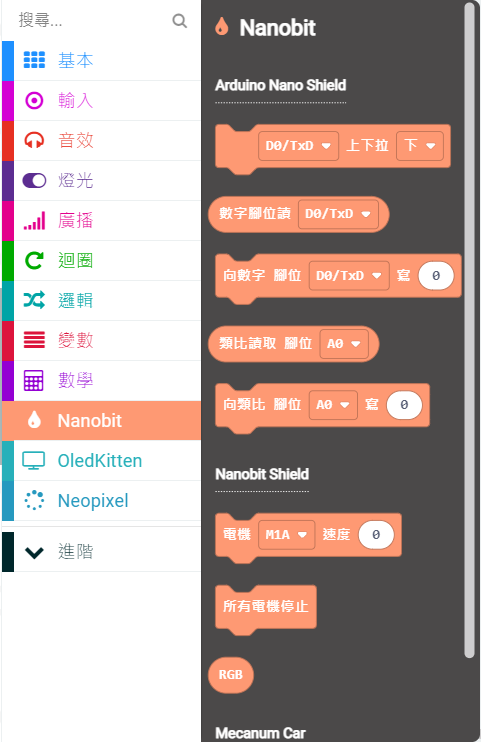
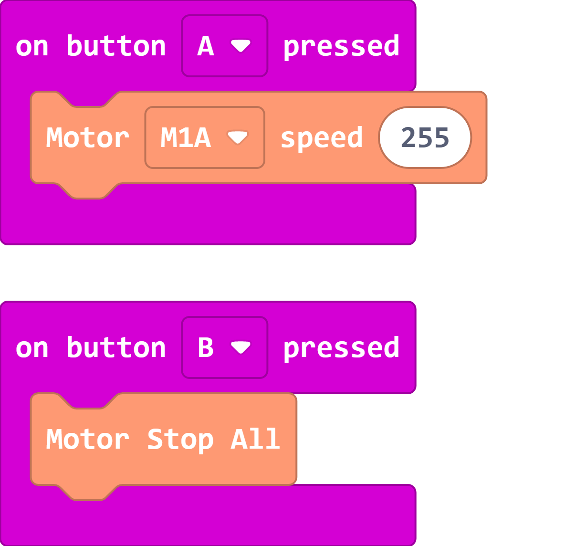
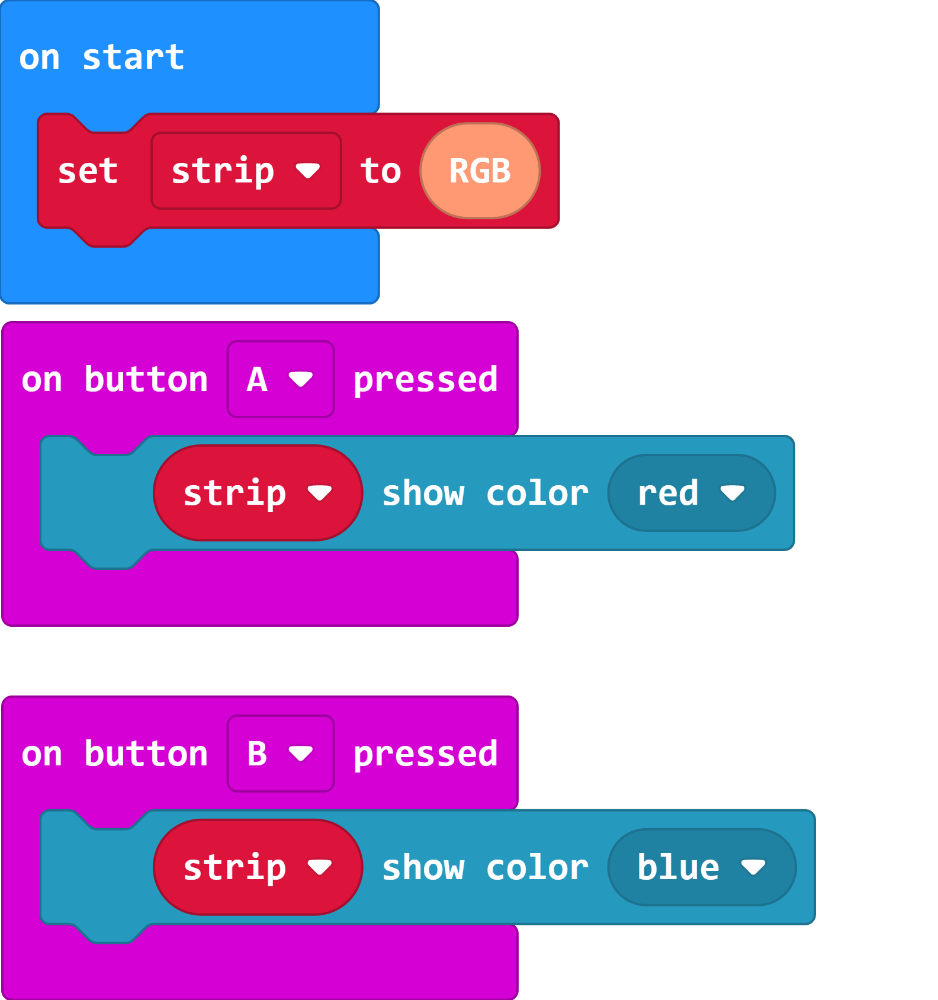

# Nanobit Shield Expansion Board

Nanobit is already compatible with numerous Arduino Nano expansion shields, KittenBot has also developed a shield for Nanobit to provide features such as power, DC motor driver, buzzer and RGB LEDs.

## Special Features

- Compact yet fully featured, includes DC motor driver, buzzer and RGB LED
- Built-in battery holder provides sufficient power to the Nanobit.
- Built-in USB Charging port with protection circuit, ensuring safety with lithium battery.
- Built-in connection holes compatible with Lego technic pins.

## Specifications

- Dimensions: 78  x 57 x 23 mm
- Weight: 37.5g
- Input Voltage: 3.7V(14650 Lithium Battery)/5V(USB)
- Working Voltage: 3.7V
- Vin External Power: Maximum 5V 3A
- Onboard Resources: GPIO Pins *15, Buzzer, RGB LED *2, Motor Ports *4, I2C Port, 5V Output Pins *3, Power Switch, Battery Activating Switch, USB Charging Port, External Power Input

## Onboard Resources Details

## Connecting Nanobit to Nanobit Shield

Insert the Nanobit onto Nanobit Shield as shown in the picture. Align the VIN pin on both the Nanobit and the Nanobit Shield and then fully insert the Nanobit into the connector.

## MakeCode Programming Quickstart

### Nanobit Shield Extension: https://github.com/Kittenbot/pxt-nanobit

[Importing Extensions](../Makecode/powerBrickMC.md)

### Nanobit Shield Blocks:

### Sample Program: Driving Motors

    Note: The USB port on the Nanobit is for charging only, please use the the Nanobit downloader to flash programs.

### Sample Program: RGB LEDs

    Note: The USB port on the Nanobit is for charging only, please use the the Nanobit downloader to flash programs.

